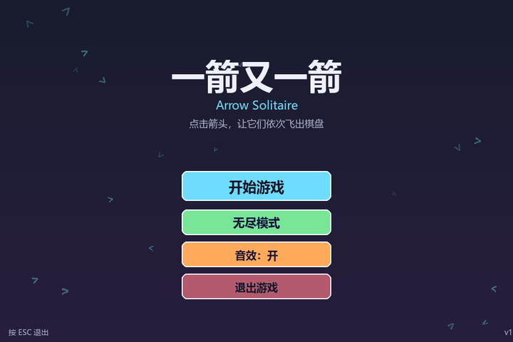
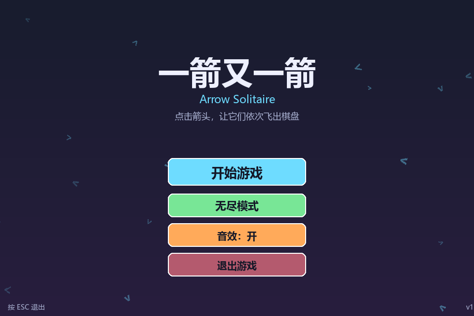
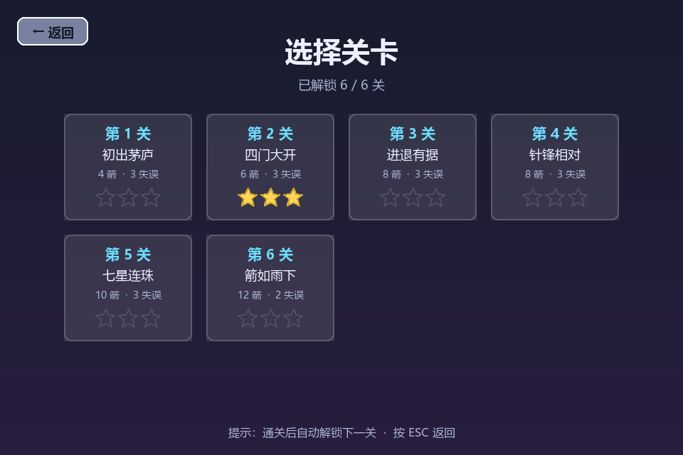
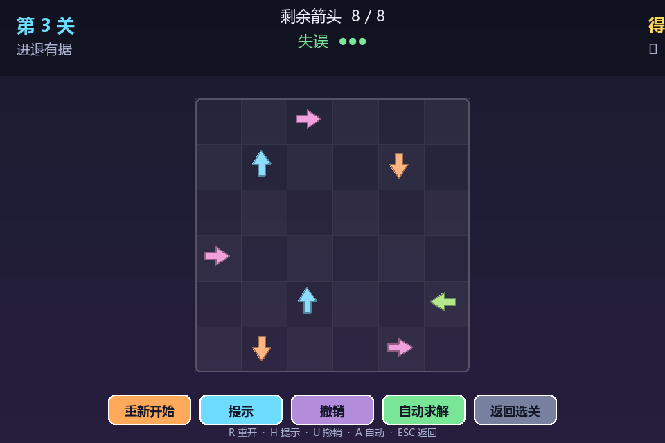
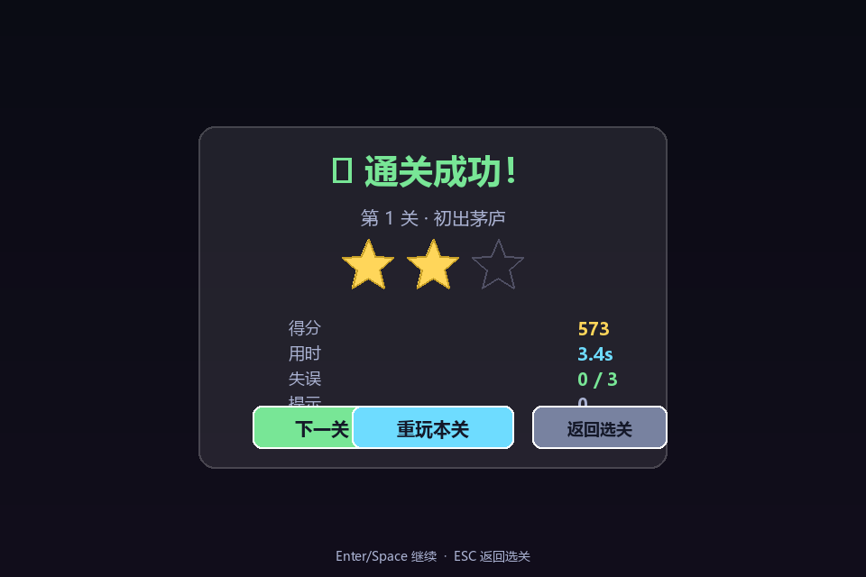
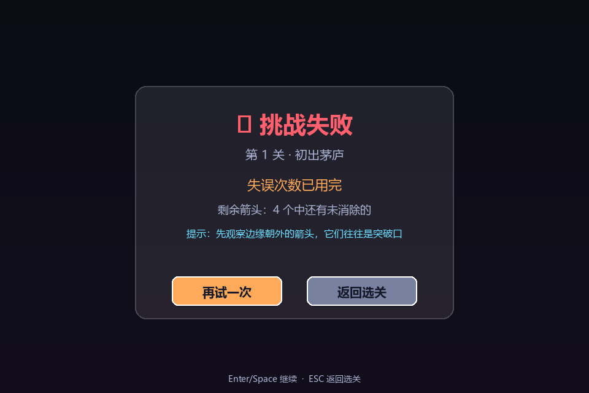

# 一箭又一箭 · Arrow Solitaire

> 2026 秋 软件工程 个人作业（第二次）  
> 作者：[cccccheyu](https://github.com/cccccheyu)  
> 课程作业要求：利用 AIGC 完成"一箭又一箭"小游戏

一个基于 **Python + Pygame** 的点击式箭头解谜游戏。观察箭头的方向与相互阻挡关系，按合适顺序点击，让所有箭头依次飞出棋盘。

---

## 📸 游戏截图与演示

### 完整演示 GIF



> 演示内容：主菜单 → 选关 → 碰撞反馈 → 撤销 → 完美通关 → 三星结算。

### 各界面截图

| 主菜单 | 关卡选择 | 游戏进行中 |
|:---:|:---:|:---:|
|  |  |  |

| 通关结算 | 失败界面 | AI 自动求解 |
|:---:|:---:|:---:|
|  |  |  |

> 截图与 GIF 均由 `tools/capture_screenshots.py` / `tools/record_demo.py` 以无头模式自动生成。

---

## 🎮 游戏简介

### 核心规则
- 棋盘上有若干带方向的箭头（上 `^` / 下 `v` / 左 `<` / 右 `>`）。
- 点击某个箭头后，程序检查该箭头前进方向上的路径：
  - **路径通畅**（与边界之间没有其他箭头）→ 箭头飞出棋盘并被消除；
  - **路径被阻挡** → 箭头不能消除，发生抖动 + 红色闪烁 + 粒子反馈，消耗一次失误机会。
- 清除本关全部箭头 → 通关，进入下一关；
- 失误次数耗尽 → 本关失败，可重新开始。

### 特色功能（含全部附加分项目）
| 功能 | 说明 | 快捷键 |
|---|---|---|
| 🎯 **6 个手工关卡** | 难度递增，每关都经过求解器验证可通关 | — |
| ♾️ **无尽模式** | 随机生成可通关关卡，难度 1~5 递增 | — |
| ⭐ **三星评价** | 0 失误=3星，1 失误=2星，≥2 失误=1星 | — |
| 🏆 **得分系统** | 基础分 + 连击加成 + 时间奖励 − 失误/提示/撤销扣分 | — |
| ⏱️ **计时器** | 实时显示用时，通关后按 par_time 计算时间奖励 | — |
| 💡 **提示功能** | 高亮一步"解锁最多后续"的安全解（扣 80 分） | `H` |
| ↩️ **撤销上一步** | 完整恢复棋盘/失误/得分/连击（扣 30 分） | `U` |
| 🤖 **AI 自动求解** | DFS 求解器 + 动画演示通关 | `A` |
| 💾 **进度保存** | JSON 本地存档：解锁进度、最佳得分、星级、音效开关 | — |
| 🎵 **程序化音效** | 用 numpy 合成波形，无外部音频文件 | — |
| ✨ **粒子与缓动动画** | 飞出尾迹、碰撞抖动、通关彩纸、星星逐个点亮 | — |
| 📦 **可打包为 exe** | 提供 PyInstaller spec 与一键脚本 | — |

---

## 🛠️ 开发环境

| 项目 | 版本 |
|---|---|
| 操作系统 | Windows 10/11（也支持 macOS / Linux） |
| Python | 3.10+（开发使用 3.13.3） |
| Pygame | 2.6.1 |
| NumPy | 1.26+（用于程序化音效合成，可选） |
| IDE | Qoder / VS Code |
| AIGC 工具 | Qoder（Coding Agent）、ChatGPT、DeepSeek |

---

## 🚀 安装与运行

### 1. 克隆仓库
```bash
git clone https://github.com/cccccheyu/arrow-game.git
cd arrow-game
```

### 2. 安装依赖
```bash
pip install -r requirements.txt
```

### 3. 运行游戏
```bash
python main.py
```

或：
```bash
python -m arrow_game
```

### 4. 运行测试
```bash
python -m unittest discover -s tests -v
```

### 5. 打包为可执行文件（Windows）
```bash
pip install pyinstaller
build.bat
```
生成的 exe 位于 `dist/ArrowSolitaire/` 目录。

---

## ❓ 常见问题（FAQ）

按运行顺序排列，遇到报错可直接对照排查。

### 1. `ModuleNotFoundError: No module named 'pygame'`

依赖没装。执行：

```bash
pip install -r requirements.txt
```

国内网络较慢时可加镜像源：

```bash
pip install -r requirements.txt -i https://pypi.tuna.tsinghua.edu.cn/simple
```

### 2. `ModuleNotFoundError: No module named 'numpy'`

**这是可选依赖，不装也能玩。** numpy 只用于程序化音效合成，程序通过 `sound.py` 里的 `_HAS_NUMPY` 标志检测：装了就有音效，没装则自动静音运行，不会崩溃。想要音效再 `pip install numpy` 即可。

### 3. `pygame.error: video system not initialized` 或窗口闪一下就退出

说明当前环境**没有可用的图形界面**（远程 SSH、服务器、未开桌面的虚拟机等）。本游戏是 pygame 桌面程序，必须在真实桌面环境下运行（Windows 桌面 / macOS / 带 X11 的 Linux）。

### 4. 中文显示成方框（豆腐块）

程序会依次尝试 `microsoftyahei` → `msyh` → `simhei` → `pingfangsc` → `notosanscjksc` 查找系统中文字体；若 `match_font` 失效（例如 dummy 驱动），会自动扫描系统字体目录兜底，最后才回退到默认字体。

如果仍显示异常，说明系统确实缺少中文字体：Windows 一般自带微软雅黑；Linux 可执行 `sudo apt install fonts-noto-cjk`。

### 5. 没有声音，或报 `pygame.error: mixer not initialized`

无音频设备（虚拟机、远程桌面、未插音频设备）时 `pygame.mixer.init()` 会失败，该异常被捕获并**静默降级为静音**，不影响游戏逻辑与画面。属于正常现象，无需处理。

### 6. `ModuleNotFoundError: No module named 'arrow_game'`

没有在项目根目录运行。先切到包含 `main.py` 的目录再启动：

```bash
cd arrow-game
python main.py
```

### 7. 存档 / 进度丢失，或想重置进度

存档文件是项目根目录下的 `arrow_game_save.json`（用 PyInstaller 打包后，位于 exe 同目录）。**删掉它即可重置全部进度**（解锁关卡、最佳得分、星级）。该文件已列入 `.gitignore`，不会被提交到仓库。

### 8. 运行测试时提示 pygame 相关错误

`tests/` 下的测试会在导入前设置 `SDL_VIDEODRIVER=dummy` 与 `SDL_AUDIODRIVER=dummy`，因此可在无图形环境下运行。其中 `tests/test_edge_cases.py` 只覆盖纯逻辑层（`Board` / `path_check` / `solver`），**完全不依赖 pygame**。

### 9. 报 `SyntaxError`

需要 **Python 3.10 及以上**（代码使用了 `X | None` 联合类型标注）。用 `python --version` 确认版本；过低请升级 Python。

---

## 🎯 游戏操作说明

### 鼠标
- **左键点击箭头**：尝试射出
- **左键点击按钮**：触发对应功能
- **悬停按钮**：显示工具提示

### 键盘
| 按键 | 功能 |
|---|---|
| `R` | 重新开始当前关卡 |
| `H` | 提示（高亮一步安全解，扣 80 分） |
| `U` | 撤销上一步（扣 30 分） |
| `A` | AI 自动求解演示（再次按下停止） |
| `ESC` | 返回上一级 / 退出 |
| `Enter` / `Space` | 结果界面继续 |

### 界面元素
- **顶部 HUD**：关卡编号、关卡名、剩余箭头、失误次数（●○ 显示）、得分、计时、连击
- **中部棋盘**：深浅相间的网格，箭头按方向着色
- **底部按钮栏**：重新开始 / 提示 / 撤销 / 自动求解 / 返回选关

---

## 📁 项目结构

```
arrow-game/
├── main.py                        # 程序入口
├── requirements.txt               # 依赖
├── README.md                      # 本文件
├── build.spec                     # PyInstaller 打包配置
├── build.bat                      # Windows 一键打包脚本
├── arrow_game/                    # 核心游戏包
│   ├── __init__.py
│   ├── constants.py               # 全局常量（配色/尺寸/得分规则）
│   ├── direction.py               # 方向枚举
│   ├── arrow.py                   # 箭头实体与状态机
│   ├── board.py                   # 棋盘模型（网格/快照/恢复）
│   ├── path_check.py              # 路径检测核心算法
│   ├── level.py                   # 关卡数据 + 6 个内置关卡
│   ├── level_gen.py               # 随机关卡生成器（含可解性验证）
│   ├── solver.py                  # DFS 自动求解器
│   ├── animations.py              # 缓动/粒子/飞出/抖动动画
│   ├── renderer.py                # 渲染层（棋盘/箭头/HUD/按钮）
│   ├── ui.py                      # UI 控件（Button/ButtonGroup）
│   ├── save.py                    # 存档系统（JSON）
│   ├── sound.py                   # 程序化音效合成
│   ├── game.py                    # 游戏主管理器
│   └── scenes/                    # 场景系统
│       ├── __init__.py
│       ├── base.py                # Scene 基类 + SceneManager
│       ├── menu.py                # 主菜单
│       ├── level_select.py        # 关卡选择
│       ├── game.py                # 游戏主场景（核心玩法）
│       ├── result.py              # 通关/失败结算
│       └── ending.py              # 全通关结局
├── tests/                         # 单元测试（72 个用例）
│   ├── __init__.py
│   ├── test_path_check.py         # 路径检测与棋盘基础
│   ├── test_levels.py             # 关卡可解性 + 求解器 + 生成器
│   └── test_save.py               # 存档系统
├── tools/                         # 开发工具
│   ├── capture_screenshots.py     # 无头模式自动截图
│   └── record_demo.py             # 无头模式录制演示 GIF
└── docs/                          # 文档
    ├── AIGC_USAGE.md              # AIGC 使用记录（≥3 次）
    ├── TEST_REPORT.md             # 测试报告（T01~T06）
    ├── PSP.md                     # PSP 表格
    ├── demo.gif                   # 演示 GIF
    └── screenshots/               # 游戏截图
```

---

## 🧪 测试

项目包含 **72 个单元测试**，覆盖：
- 路径检测（四方向、边界、阻挡、T01/T02/T03）
- 棋盘基础操作（增删、快照恢复、序列化）
- 关卡可解性（6 个内置关卡全部通过求解器验证）
- 求解器正确性（空盘、单箭头、死锁、多解计数）
- 随机生成器（可解性、可复现性、无尽序列）
- 存档系统（读写、最佳记录、解锁进度、损坏恢复）
- **边界与异常防御（空棋盘、单箭头、细长棋盘、非法尺寸、越界坐标、非 IDLE 状态拦截，T07/T08）**

运行：
```bash
python -m unittest discover -s tests -v
```

详细测试报告见 [docs/TEST_REPORT.md](docs/TEST_REPORT.md)。

---

## 🤖 AIGC 使用记录

本项目全程使用 **Qoder（Coding Agent）** 作为主要 AIGC 工具，辅以 ChatGPT / DeepSeek 进行算法讨论与代码审查。

详细记录（≥3 次代表性协作过程）见 [docs/AIGC_USAGE.md](docs/AIGC_USAGE.md)。

---

## 📊 PSP 表格

见 [docs/PSP.md](docs/PSP.md)。

---

## 📝 课程博客


---

## 📜 许可与声明

- 本项目为课程作业，仅供学习使用。
- 不使用原商业游戏《一箭又一箭》的代码、美术素材、音效或关卡。
- 所有音效由程序实时合成（numpy 波形），无外部音频资源。
- 字体使用系统自带中文字体（微软雅黑等），无额外字体文件。

---

## 🙏 致谢

- 课程教师：FuqingWuYi
- 助教：w_111、YoutuZ
- AIGC 工具：Qoder、ChatGPT、DeepSeek
